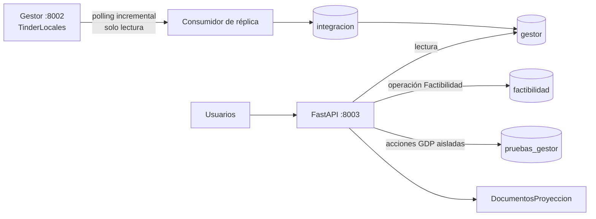
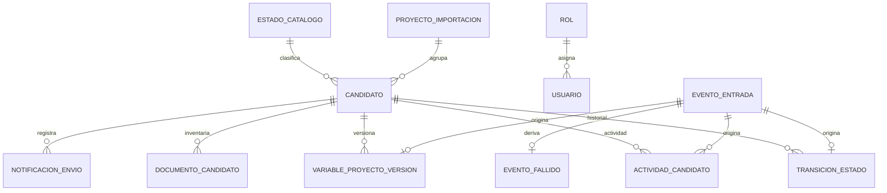

# Base de datos FactibilidadGDP — Especificación de producción

**Sistema:** FactibilidadGDP  
**Motor:** PostgreSQL  
**Base:** `FactibilidadGDP`  
**Servicio de aplicación:** FastAPI, puerto interno `8003`  
**Versión del esquema:** Alembic `20260820_06`
**Fecha de referencia:** 20-08-2026  
**Clasificación:** documentación operativa de producción

## 1. Propósito

`FactibilidadGDP` es la base transaccional del servicio FactibilidadGDP. Durante la
coexistencia con el Gestor anterior cumple tres funciones:

1. Mantener una réplica normalizada y de solo lectura del dominio administrado por el
   servicio 8002.
2. Persistir las operaciones exclusivas del módulo Factibilidad.
3. Permitir el uso controlado del Gestor en 8003 mediante una capa local aislada, sin
   enviar esas acciones a la base `TinderLocales`.

La base no implementa sincronización bidireccional. Los cambios del dominio Gestor viajan
en una sola dirección: `TinderLocales (8002) → FactibilidadGDP (8003)`.

## 2. Topología productiva



La modalidad actualmente habilitada es polling incremental con consistencia eventual.
El checkpoint usa fecha, identificador y hash; no depende solamente de timestamps.

## 3. Propiedad de datos

| Dominio | Propietario durante convivencia | Escritura desde 8003 | Ubicación |
|---|---|---:|---|
| Candidatos, estados y revisiones oficiales | Gestor 8002 | No | `gestor.*` |
| Usuarios y roles oficiales | Gestor 8002 | No | `gestor.*` |
| Variables oficiales del Gestor | Gestor 8002 | No | `gestor.*` |
| Inventario de documentos del Gestor | Gestor 8002 | No | `gestor.documento_candidato` |
| Eventos, checkpoints y reconciliación | FactibilidadGDP | Sí | `integracion.*` |
| Checklist, decisiones, VB y entregas | FactibilidadGDP | Sí | `factibilidad.*` |
| Acciones GDP ejecutadas en 8003 | FactibilidadGDP, alcance local | Sí | `pruebas_gestor.*` |
| Archivos binarios de Factibilidad | FactibilidadGDP | Sí | filesystem aislado |

Los campos `id_candidato` de `factibilidad.*` y `pruebas_gestor.*` son referencias
lógicas al identificador legado. No tienen una FK hacia `gestor.candidato`; esto impide
que una limpieza o eliminación local se propague hacia el dominio replicado.

## 4. Esquemas

### `gestor`

Réplica normalizada del dominio compartido. Solamente el consumidor de sincronización
puede modificar sus tablas. La aplicación 8003 lo utiliza como modelo de lectura.

### `integracion`

Controla recepción, orden, aplicación, reintentos, dead-letter, checkpoints,
reconciliaciones y fases de migración.

### `factibilidad`

Contiene las entidades que pertenecen exclusivamente al módulo Factibilidad. Es el
dominio transaccional propio del servicio 8003.

### `pruebas_gestor`

Capa operativa aislada para ejecutar el flujo GDP desde 8003. Las vistas presentan la
réplica oficial y superponen únicamente las acciones locales. Una operación aquí nunca
se publica hacia `TinderLocales`.

El nombre físico se conserva por compatibilidad con la etapa de coexistencia. No debe
renombrarse sin una migración Alembic y una ventana de cambio planificada.

## 5. Modelo relacional



Las relaciones de `factibilidad.*` y `pruebas_gestor.*` con un candidato son lógicas,
no claves foráneas físicas.

## 6. Diccionario de datos: `gestor`

### `gestor.estado_catalogo`

Catálogo normalizado de estados.

| Campo clave | Descripción |
|---|---|
| `id` | PK numérica estable. |
| `codigo` | Código único normalizado. |
| `nombre` | Nombre de presentación. |
| `orden` | Orden del flujo. |
| `estados_origen` | Valores JSON reconocidos en el sistema fuente. |
| `activo` | Habilitación del estado. |

Estados precargados: `PENDIENTE`, `OBSERVACION`, `RECHAZADO`, `EN_ESTUDIO`,
`PROPUESTO`, `APROBADO` y `PROYECTO`.

### `gestor.rol`

Catálogo de roles replicados. `codigo` es único y `activo` controla su vigencia.

### `gestor.usuario`

Identidades y permisos provenientes del Gestor.

Campos principales: `id`, `legacy_usuario_id` único, `rol_id`, `rol`, `correo`,
`nombre`, `hash_contrasena`, datos organizacionales, `activo`, `eliminado_en`,
`payload_origen`, `hash_origen` y `sincronizado_en`.

El hash de contraseña es dato sensible. Nunca debe aparecer en reportes, logs o
respaldos sin cifrado.

### `gestor.proyecto_importacion`

Agrupa candidatos según el proyecto de origen. Conserva `legacy_proyecto_id`, nombre,
archivo, fecha original, payload y hash de origen.

### `gestor.candidato`

Entidad maestra normalizada del local candidato.

| Campo clave | Descripción |
|---|---|
| `id` | PK interna `bigserial`. |
| `legacy_candidato_id` | Identificador único del Gestor; clave de conciliación. |
| `id_proyeccion` | Identificador empresarial de la proyección desde su origen; obligatorio e indexado. Puede repetirse. |
| `proyecto_id` | FK a `proyecto_importacion`. |
| `estado_actual_id` | FK al estado normalizado vigente. |
| `estado_origen` | Estado literal recibido; nunca se descarta. |
| `certeza_mapeo` | `EXACTA`, `INFERIDA` o `DESCONOCIDA`. |
| `version_origen` | Versión usada para controlar orden y concurrencia. |
| `referencia_mapa`, `latitud`, `longitud` | Georreferencia del local. |
| `datos` | Datos funcionales normalizados en JSONB. |
| `payload_origen` | Registro fuente preservado en JSONB. |
| `hash_origen` | SHA-256 lógico para reconciliación e idempotencia. |
| `actualizado_origen_en`, `sincronizado_en` | Tiempos de origen y réplica. |

### `gestor.transicion_estado`

Historial inmutable de cambios reales de estado. Conserva estado anterior/nuevo,
acción, comentario, actor, orden y fecha original. `evento_origen_id` es único, por lo
que el mismo evento no puede crear dos transiciones.

### `gestor.actividad_candidato`

Registra comentarios y actividades que no constituyen una transición de estado. La
combinación `(evento_origen_id, tipo)` es única.

### `gestor.variable_proyecto_version`

Historial versionado de Variables. Solo una versión debe permanecer `vigente=true` por
candidato. Son únicas tanto `(candidato_id, version)` como `evento_origen_id`.

### `gestor.documento_candidato`

Inventario de documentos del Gestor. No almacena el binario: registra ruta, nombre,
tamaño, modificación, SHA-256, presencia y fecha de inventario. La combinación
`(candidato_id, ruta_origen)` es única.

### `gestor.notificacion_envio`

Bitácora de notificaciones. Guarda tipo, destinatarios, estado y si el envío fue
suprimido por modo espejo. `(evento_origen_id, tipo)` evita duplicaciones.

### `gestor.punto_interes`

Capa geográfica replicada. Conserva identificador legado único, nombre, coordenadas
opcionales, categoría, atributos JSONB y hash.

## 7. Vistas de `gestor`

| Vista | Uso |
|---|---|
| `vw_pendientes` | Candidatos normalizados en `PENDIENTE`. |
| `vw_observacion` | Candidatos en `OBSERVACION`. |
| `vw_rechazados` | Candidatos en `RECHAZADO`. |
| `vw_en_estudio` | Candidatos en `EN_ESTUDIO`. |
| `vw_propuestos` | Candidatos en `PROPUESTO`. |
| `vw_aprobados` | Candidatos en `APROBADO`. |
| `vw_proyectos` | Candidatos en `PROYECTO`. |
| `vw_metricas_flujo` | Cantidad por estado y orden del flujo. |
| `proyecto` | Adaptador compatible con el ORM histórico. |
| `candidato_ubicacion` | Adaptador del candidato normalizado al contrato histórico. |
| `revision` | Unión de transiciones y comentarios con IDs legados. |
| `variables_proyecto_candidato` | Versión vigente de Variables en formato histórico. |

Las vistas de compatibilidad son de lectura dentro de `gestor`.

## 8. Diccionario de datos: `integracion`

### `integracion.evento_entrada`

Inbox idempotente de la réplica. Registra UUID interno, identificador único de origen,
LSN cuando existe, tabla, operación, clave, candidato, orden, fechas, payload, hash,
estado, intentos y próximo reintento.

Estados operativos esperados: `PENDIENTE`, `PROCESANDO`, `APLICADO`, `REINTENTO` y
`FALLIDO`, según la etapa del consumidor.

### `integracion.evento_salida`

Outbox de acciones deliberadamente no publicadas. `modo` solo admite `PRUEBA` o
`SUPRIMIDO`. No constituye un canal de sincronización hacia 8002.

### `integracion.checkpoint_cdc`

Posición confirmada por consumidor: LSN, última fecha, ID, hash y momento de
actualización. En polling, fecha + ID + hash forman el desempate incremental.

### `integracion.evento_fallido`

Dead-letter de eventos que agotaron reintentos. Conserva tipo y detalle del error,
número de intentos, primer/último fallo y resolución.

### `integracion.reconciliacion`

Resultado de comparar origen y destino. Guarda totales, diferencias, cantidad y rutas
de reportes JSON/CSV.

### `integracion.migracion_control`

Checkpoint reanudable para snapshot, migraciones y procesos extensos. Su PK `clave`
identifica una ejecución lógica.

## 9. Diccionario de datos: `factibilidad`

### `factibilidad.tarea_local`

Estado de una subtarea por local. La combinación `(id_candidato, clave_tarea)` es única.
Registra macrotarea, tarea, estado, comentario, usuario y fecha de actualización.

Estados funcionales: `Realizado`, `En Proceso`, `No Realizado` y `No Aplica`,
persistidos mediante los códigos definidos por la aplicación.

### `factibilidad.decision_local`

Una decisión por candidato. Registra `Rechazado` o `Completado`, autor y fecha, sin
cambiar el estado oficial del Gestor.

### `factibilidad.visto_bueno_local`

Visto bueno por área. `(id_candidato, area)` es único. Conserva autor y timestamp del VB
de Legal o Arquitectura.

### `factibilidad.entrega`

Traspaso del expediente a otra área. Registra área destino, estado, antecedentes JSONB,
responsable y fechas de creación, actualización y entrega.

## 10. Capa `pruebas_gestor`

### Tablas

| Tabla | Función |
|---|---|
| `candidato_override` | Estado de workflow local del candidato en 8003. |
| `revision_local` | Revisiones y comentarios ejecutados desde 8003. |
| `variable_override` | Copia editable de Variables para el flujo local. |

Los IDs de `revision_local` y `variable_override` utilizan secuencias negativas. Así no
colisionan con los IDs positivos replicados.

### Vistas escribibles

| Vista | Comportamiento |
|---|---|
| `candidato_ubicacion` | Lee atributos vivos desde `gestor` y superpone el workflow local. |
| `revision` | Une historial oficial y revisiones locales. Los INSERT se redirigen por trigger. |
| `variables_proyecto_candidato` | Muestra Variables oficiales o la copia local cuando existe. |

Triggers `INSTEAD OF` convierten las escrituras del ORM histórico en upserts sobre las
tablas locales. Ningún trigger apunta a `gestor` ni a la base fuente.

El `search_path` productivo del proceso 8003 es:

```text
pruebas_gestor,factibilidad,gestor,integracion,public
```

## 11. Transacciones e idempotencia

Para cada evento recibido:

1. Se identifica por `evento_origen_id` y hash.
2. Se respeta `orden_origen` por candidato.
3. Se bloquea o valida la versión del candidato.
4. Se actualiza el estado normalizado.
5. Se inserta transición o actividad.
6. Se crea una nueva versión de Variables cuando corresponde.
7. Se actualiza el checkpoint.
8. Se confirma todo en una única transacción PostgreSQL.

Ante cualquier error, se revierte la transacción completa. Una recepción duplicada
encuentra las restricciones únicas existentes y no produce un segundo efecto.

## 12. Archivos y adjuntos

PostgreSQL no contiene los binarios. El servicio utiliza directorios separados bajo:

```text
/home/mbustos/FactibilidadGDP/DocumentosProyeccion
```

Los documentos del módulo Factibilidad se organizan por candidato, área y macrotarea.
Las copias de ficha e imágenes también permanecen en el árbol aislado de Factibilidad.

Un respaldo completo exige respaldar conjuntamente:

- la base `FactibilidadGDP`;
- `DocumentosProyeccion`;
- el `.env` de producción, cifrado y fuera de Git;
- las unidades systemd y su configuración.

## 13. Seguridad

- `DATABASE_URL` usa un usuario con escritura solamente sobre `FactibilidadGDP`.
- `LEGACY_DATABASE_URL` debe usar un usuario de solo lectura sobre `TinderLocales`.
- Las credenciales se almacenan en `.env` con permiso `600` y nunca en Git.
- `SESSION_COOKIE_NAME=factibilidad_session` separa sesiones de los otros servicios.
- Con `SHADOW_MODE=true`, el envío real de correos permanece bloqueado.
- `EMAIL_DELIVERY_ENABLED=false` es una segunda barrera independiente.
- La aplicación no crea publicaciones ni slots de replicación automáticamente.
- Los respaldos `.env.*`, temporales `.codex-upload/`, documentos y dumps están ignorados.

## 14. Migraciones

La estructura es propiedad exclusiva de Alembic. En producción no se ejecuta
`Base.metadata.create_all()`.

| Revisión | Contenido |
|---|---|
| `20260820_01` | Esquemas, modelo normalizado, integración, Factibilidad, vistas y estados. |
| `20260820_02` | IDs legados en vistas de compatibilidad. |
| `20260820_03` | Coordenadas opcionales para puntos de interés. |
| `20260820_04` | Capa aislada y escribible del Gestor en 8003. |
| `20260820_05` | Atributos vivos de la réplica bajo el workflow local. |
| `20260820_06` | ID de proyección empresarial como columna obligatoria e indexada. |

Comandos operativos:

```bash
cd /home/mbustos/FactibilidadGDP
source .venv/bin/activate
python -m app.replication.cli migrate --dry-run
python -m app.replication.cli migrate
```

Toda migración debe probarse primero contra una base temporal `factibilidad_test_<UUID>`.
Los downgrades destructivos están bloqueados; el rollback productivo se realiza mediante
respaldo verificado y procedimiento controlado.

## 15. Monitoreo

| Endpoint | Validación |
|---|---|
| `/health` | Proceso FastAPI disponible. |
| `/health/db` | Conexión a `FactibilidadGDP`. |
| `/health/legacy` | Lectura de la base fuente. |
| `/health/replication` | Modo, checkpoint, retraso, pendientes, fallidos y diferencias. |

Condiciones de alerta:

- `lag_seconds` supera el umbral configurado;
- existen eventos `FALLIDO` o reintentos persistentes;
- la reconciliación informa diferencias;
- el checkpoint deja de avanzar mientras 8002 continúa recibiendo cambios;
- la última transición reconstruida no coincide con el estado actual.

## 16. Reconciliación

La validación compara:

- total de candidatos;
- cantidad por estado;
- último estado por candidato;
- cantidad y orden de revisiones;
- comentarios;
- usuarios;
- Variables vigentes;
- inventario de documentos;
- hashes relevantes.

Ejecución:

```bash
python -m app.replication.cli reconcile --dry-run
python -m app.replication.cli reconcile
```

Los reportes se generan en JSON y CSV. Una reconciliación productiva satisfactoria debe
terminar con `diferencias_cantidad=0` o con excepciones formalmente justificadas.

## 17. Respaldo y recuperación

Antes de una migración:

```bash
docker exec postgres_tinder_locales sh -c \
  'pg_dump -U "$POSTGRES_USER" -d FactibilidadGDP -Fc' \
  > /home/mbustos/backups/FactibilidadGDP/FactibilidadGDP_YYYYMMDDTHHMMSSZ.dump
chmod 600 /home/mbustos/backups/FactibilidadGDP/FactibilidadGDP_YYYYMMDDTHHMMSSZ.dump
```

La restauración debe ensayarse primero en una base nueva y nunca directamente sobre la
base activa. El procedimiento productivo requiere ventana, detención de escrituras,
validación del dump, restauración, Alembic, reconciliación y prueba de salud.

No se han establecido en el repositorio valores contractuales de RPO, RTO ni retención de
respaldos. Deben ser definidos por Operaciones antes de considerar cerrado el SLA.

## 18. Consultas operativas de solo lectura

```sql
-- Revisión desplegada
SELECT version_num FROM alembic_version;

-- Conteo por estado
SELECT * FROM gestor.vw_metricas_flujo;

-- Trazabilidad por ID empresarial de proyección
SELECT id_proyeccion, legacy_candidato_id, id, estado_origen
FROM gestor.candidato
ORDER BY id_proyeccion, legacy_candidato_id;

-- Estado del inbox
SELECT estado, count(*)
FROM integracion.evento_entrada
GROUP BY estado
ORDER BY estado;

-- Último checkpoint
SELECT consumidor, source_lsn, ultima_fecha, ultimo_id, actualizado_en
FROM integracion.checkpoint_cdc
ORDER BY actualizado_en DESC;

-- Eventos en dead-letter aún no resueltos
SELECT id, evento_entrada_id, error_tipo, intentos, ultimo_fallo_en
FROM integracion.evento_fallido
WHERE resuelto_en IS NULL
ORDER BY ultimo_fallo_en DESC;

-- Volumen propio de Factibilidad
SELECT
  (SELECT count(*) FROM factibilidad.tarea_local) AS tareas,
  (SELECT count(*) FROM factibilidad.decision_local) AS decisiones,
  (SELECT count(*) FROM factibilidad.visto_bueno_local) AS vistos_buenos,
  (SELECT count(*) FROM factibilidad.entrega) AS entregas;
```

## 19. Limpieza controlada de la capa GDP local

Esta operación elimina únicamente acciones GDP realizadas en 8003. No limpia
`factibilidad.*`, `gestor.*`, `integracion.*`, documentos ni `TinderLocales`.

```sql
BEGIN;
TRUNCATE TABLE pruebas_gestor.revision_local,
               pruebas_gestor.variable_override,
               pruebas_gestor.candidato_override
RESTART IDENTITY;
COMMIT;
```

En producción debe existir respaldo, ticket aprobado y validación del nombre de la base
antes de ejecutar cualquier `TRUNCATE`.

## 20. Criterios de operación saludable

La plataforma se considera saludable cuando:

- la revisión Alembic corresponde a la versión liberada;
- los cuatro endpoints de salud responden correctamente;
- el consumidor de réplica está activo;
- no existen eventos pendientes fuera del tiempo esperado ni dead-letter sin gestionar;
- el retraso está bajo el umbral configurado;
- la reconciliación no presenta diferencias;
- `gestor.*` no recibe escrituras de usuario desde 8003;
- las operaciones propias se registran en `factibilidad.*`;
- las acciones GDP locales se registran únicamente en `pruebas_gestor.*`;
- los correos permanecen deshabilitados mientras el servicio esté en modo espejo.
