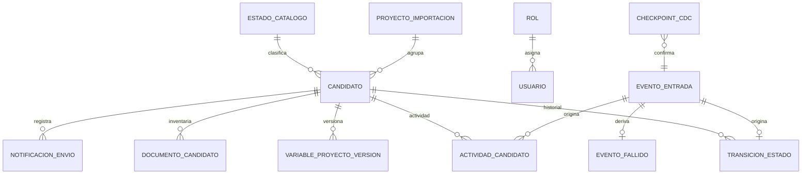

# Arquitectura transaccional de FactibilidadGDP

## Propiedad y dirección

- El servicio 8002 es el único sistema de registro del dominio Gestor durante la convivencia.
- `gestor.*` es una réplica de solo lectura para la aplicación 8003.
- `factibilidad.*` es propiedad exclusiva del servicio 8003.
- `integracion.*` contiene inbox/outbox de prueba, checkpoints, errores y reconciliaciones.
- No existe ningún publicador desde 8003 hacia 8002.
- Con `SHADOW_MODE=true`, los intentos de escritura en rutas del Gestor se registran como
  `integracion.evento_salida.modo=PRUEBA` y se rechazan; no modifican la réplica.
- Los correos están bloqueados si `SHADOW_MODE=true` o `EMAIL_DELIVERY_ENABLED=false`.

## ERD

Las tablas del diagrama pertenecen a `gestor` e `integracion`. `factibilidad.entrega`,
`factibilidad.tarea_local`, `factibilidad.decision_local` y
`factibilidad.visto_bueno_local` utilizan `candidato_legacy_id` como referencia lógica. No tienen
FK hacia el origen ni permiten cascadas hacia el Gestor.

## Idempotencia y orden

1. Cada cambio se inserta primero en `integracion.evento_entrada`.
2. `evento_origen_id` es único. CDC además conserva LSN, tabla, clave y orden.
3. El consumidor selecciona eventos por `orden_origen`.
4. Bloquea el candidato con `SELECT FOR UPDATE`.
5. Aplica candidato, transición, actividad, versión de Variables y checkpoint en una transacción.
6. Solo confirma el WAL después de confirmar el inbox.
7. Un reenvío encuentra el mismo evento y no vuelve a producir efectos.

Los fallos usan backoff exponencial. Al quinto intento pasan a dead-letter en
`integracion.evento_fallido`; `replication.cli replay` permite reencolarlos.

## Traducción de estados

Siempre se conserva `estado_origen`. La clasificación queda en `certeza_mapeo`.

| Valores de origen | Destino | Certeza |
|---|---|---|
| `pendiente`, `pending` | `PENDIENTE` | EXACTA |
| `devuelto`, `returned`, `sugerido`, `suggested` | `PENDIENTE` | INFERIDA |
| `observacion`, `observation` | `OBSERVACION` | EXACTA |
| `rechazado`, `rejected` | `RECHAZADO` | EXACTA |
| `en_estudio`, `study` | `EN_ESTUDIO` | EXACTA |
| `aprobado`, `approved`, `approved_final` | `PROPUESTO` | INFERIDA |
| `locales_proyecto`, `approved_location` | `APROBADO` | INFERIDA |
| `por_abrir`, `opening`, `project` | `PROYECTO` | INFERIDA |
| cualquier otro | `PENDIENTE` provisional | DESCONOCIDA |

Un valor DESCONOCIDO genera una discrepancia de reconciliación y debe resolverse mediante una
nueva migración/versionamiento del mapeo; el consumidor nunca corrige el origen.

## CDC y polling

CDC requiere `wal_level=logical`, capacidad disponible, identidad de réplica apropiada y un slot
precreado con `wal2json`. El consumidor incluido nunca crea o elimina publicaciones/slots.

La creación del slot debe exportar un snapshot consistente. El snapshot se importa desde esa
misma transacción y el consumidor comienza en su LSN consistente. Solo este camino satisface una
frontera sin pérdida durante escrituras concurrentes.

Si CDC no está autorizado o disponible, `REPLICATION_MODE=polling` usa fecha+ID+hash y revisión
por ID creciente. Es consistencia eventual. Los cambios sin marcador confiable se detectan con
reconciliación completa; no se presenta como equivalencia transaccional con CDC.
